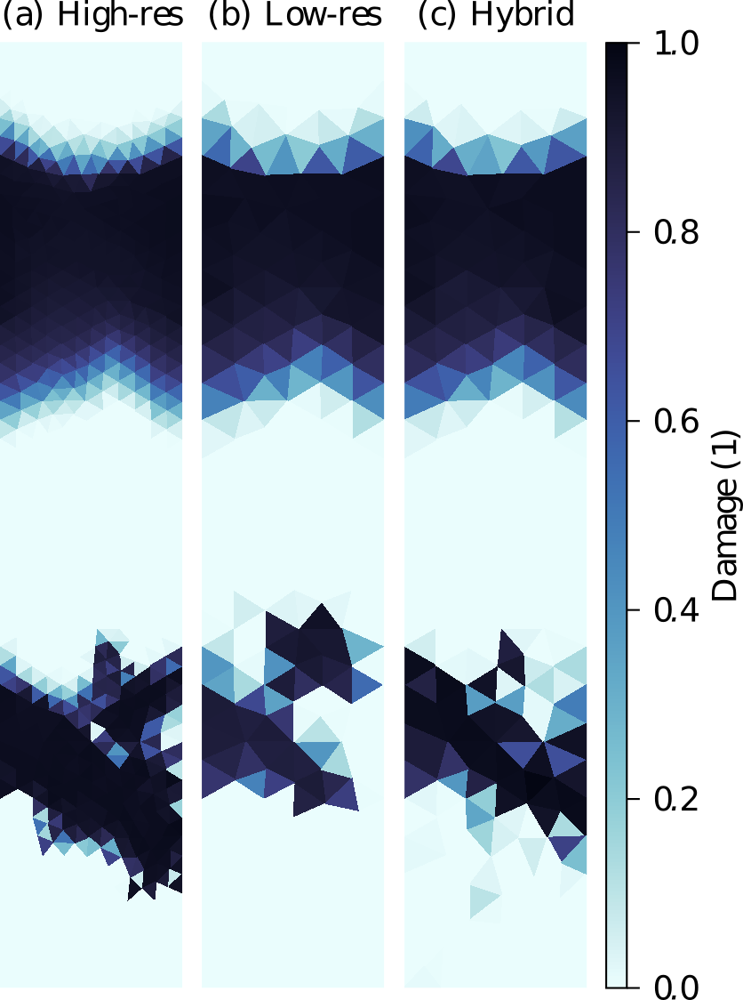

Deep learning of subgrid-scale parametrisations for sea-ice dynamic
===================================================================

<div style="text-align: center;">

</div>

If you are using these scripts and the repository, please cite:

> Finn et al., 2023. Deep learning subgrid-scale parametrisations for
> short-term forecasting of sea-ice dynamics with a Maxwell elasto-brittle rheology,
> The Cryosphere, 17, 2965–2991, https://doi.org/10.5194/tc-17-2965-2023, 2023

and to cite specific versions of the code:

> Finn et al. (2023). cerea-daml/hybrid_nn_meb_model: Zenodo. 
> https://doi.org/10.5281/zenodo.7997435
--------

In this work, we show a proof-of-concept that deep learning can parametrise the 
subgrid-scale for sea-ice dynamics. Although, this have been already proven 
useful for other components of the Earth system, sea-ice dynamics impose new 
challenges for deep learning. Our here implemented neural network works directly
on triangular model data from finite element based models by internally 
projecting the data into Cartesian space. Furthermore, the neural network learns
to correct all forecast model variables at the same time by using a maximum
likelihood approach during training. Our results show that the hybrid model
performs in general better than the geophysical model without correction and the
persistence forecast for a lead time of up to one hour. 

The scripts and module is written in PyTorch [[1]](#1), Pytorch lightning
[[2]](#2) and configured with Hydra [[3]](#3).

The folder structure is the following:
```
.
|-- configs            # The hydra config scripts.
|-- data               # Storage of the data
|   |-- interim        # Data that is included within the repo
|   |-- models         # The trained models will be stored here
|   |-- processed      # The prediction data, processed by the hybrid models, is stored here
|   |-- raw            # The raw model data
|   |   |-- train      # The data and datasets for training
|   |   |-- eval       # The data and datasets for validation
|   |   |-- test       # The data and datasets for test
|-- meb_model          # Config files and geometry used to run the MEB model 
|-- notebooks          # Notebooks that were used to visualize the results
|-- scripts            # Scripts to generate data, includes readme.
|-- src_screening      # The python module used in the scripts and notebooks
|   |-- callbacks      # Different Pytorch lightning callbacks
|   |-- data_module    # The Pytorch lightning datamodule
|   |-- datasets       # The Pytorch dataset, reading the zarr files
|   |-- model          # Functions and classes for the MEB model
|   |-- network        # Functions and classes for the neural network
|   |   |-- backbone   # The feature extraction Pytorch modules
|   |   |-- layers     # Specific Pytorch layers, e.g. ConvNeXt blocks
|   |-- loss_funcs.py  # Own specified loss functions with trainable weighting
|-- environment.yml    # A possible environment configuration
|-- LICENSE.txt        # The license file
|-- predict_offline.py # Python script to predict with neural network without cycling
|-- predict_short.py   # Python script to predict with hybrid model with cycling for short-term forecast
|-- README.md          # This readme
|-- syncall_wandb.sh   # Bash script to sync offline logger data to W&B
|-- train.py           # Python script with hydra to train the neural networks
|-- used_env.yml       # The used conda environment with pinned versions
```
In almost all scripts only relative directories are used to reference the 
data and models.

The here-used geophysical model is a regional standalone sea-ice model that 
depicts the sea-ice dynamics in a Maxwell-Elasto-Brittle rheology 
[(Dansereau et al. 2016)](#dansereau16), see also 
[Dansereau et al. 2017](#dansereau17) and [Dansereau et al. 2021](#dansereau21).
The model geometry and config files are included within this repository, 
whereas the model code itself is available on request. The model and its python 
bindings have to be installed into the same environment as used to run the 
neural networks, e.g. based on the included environment.yml file. After the
model is installed, the data generation scripts can be executed to generate the
training and reference data and reference dataset. As the datasets and weights
of the neural network are quite large, they are available on request.

After data collection/generation, the neural networks can be trained with the 
`python train.py` script. This script trains the U-NeXt neural network as 
described in the manuscript. Several experiment configuration files can be 
found in `configs/experiment`. To train the network for such experiments 
`python train.py +experiment="experiment name"` has to be executed. Other 
command line options can be found with `python train.py --help`.

After training the neural networks, they can be used in the `predict_offline.py` 
script to generate a prediction in an offline dataset, e.g. test dataset, 
without cycling the network together with the geophysical model. To predict with
the hybrid model across several cycles, `predict_short.py` can be used. Both
scripts implement needed settings via command line arguments, accessible with
`--help`. 

The front image shows a snapshot of sea-ice damage after a one-hour forecast 
with the here-used regional sea-ice model. The initial conditions of the 
high-resolution truth (a, 4 km resolution) are projected into a low-resolution 
space with 8 km resolution. Started from these projected initial conditions, the
low-resolution forecast (b) is unable to reproduce the dynamics of the truth.
Running the low-resolution forecast in a hybrid mode (c) together with a
subgrid-scale-parametrising neural network leads to a better representation of
the sea-ice dynamics, which improves the forecast, tested up to one hour.

If you have further questions, please feel free to contact us or to create a 
GitHub issue.

--------
## References
<a id="1">[1]</a> https://pytorch.org/

<a id="2">[2]</a> https://www.pytorchlightning.ai/

<a id="3">[3]</a> https://hydra.cc/

<a id="dansereau16">[Dansereau et al. 2016]</a> Dansereau, V., et al. (2016).
"A Maxwell elasto-brittle rheology for sea ice modelling". The Cryosphere,
10(3), 1339–1359, https://doi.org/10.5194/tc-10-1339-2016.

<a id="dansereau17">[Dansereau et al. 2017]</a> Dansereau, V., et al. (2017).
"Ice bridges and ridges in the Maxwell-EB sea ice rheology". The Cryosphere,
11(5), 2033–2058, https://doi.org/10.5194/tc-11-2033-2017.

<a id="dansereau21">[Dansereau et al. 2021]</a> Dansereau, V., et al. (2021).
"A Continuum Viscous-Elastic-Brittle, Finite Element DG Model for the Fracture 
and Drift of Sea Ice". In M. Barla, A. Di Donna, & D. Sterpi (Eds.), Challenges 
and Innovations in Geomechanics (pp. 125–139). Springer International 
Publishing, https://doi.org/10.1007/978-3-030-64514-4_8

--------
<p><small>Project based on the <a target="_blank" href="https://github.com/jbusecke/cookiecutter-science-project">cookiecutter science project template</a>.</small></p>

